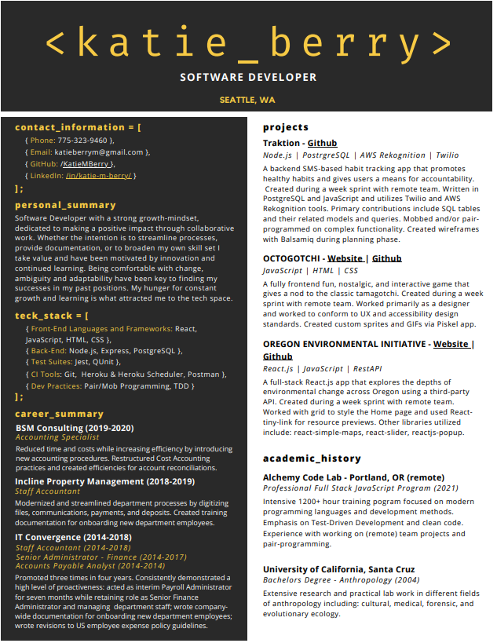

# ✨ Welcome to my Github! ✨ 

### Hiya! 👋 Please take a look around!

⚡ <a href="https://www.figma.com/proto/XPSlyclg1L5GTDKTujw5Yg/introductions?node-id=0%3A3&scaling=scale-down" target="_blank" >  <a> Click to see my Figma prototype presentation in full! ⚡
  
⚡ <a href="Katie Berry - Fullstack Developer.pdf" target="_blank" >  <a> Click to see my resume! ⚡
  

  

	

	 
	 

✨  ✨

✨  ✨

<!--
*** is a repository because its `README.md` (this file) appears on your GitHub profile.
Here are some ideas to get you started:
- 🔭 I’m currently working on ...
- 🌱 I’m currently learning ...
- 👯 I’m looking to collaborate on ...
- 💬 Ask me about ...
- 📫 How to reach me: ...
- 😄 Pronouns: she/her
-  Fun fact: ...
-->
